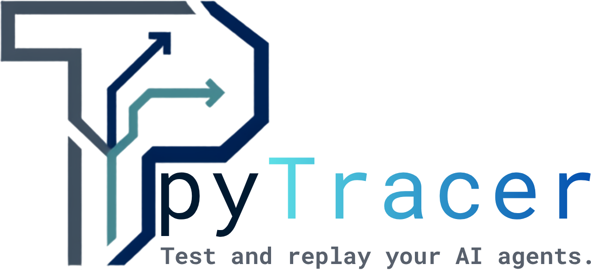

<p align="center">
  
</p>

<p align="center">
  <a href="https://pytracer.com">Website</a> &middot;
  <a href="https://pytracer.com/docs">Docs</a> &middot;
  <a href="https://pytracer.com/docs#packages">Packages</a> &middot;
  <a href="https://pypi.org/project/pytracer-all/">PyPI</a>
</p>

<p align="center">
  <a href="https://pypi.org/project/pytracer-all/"></a>
  
  
</p>

pyTracer is an **agent test and replay platform**. It captures what an AI agent
does (its LLM calls, tool calls, reasoning steps, and handoffs), replays a past
run deterministically by injecting the recorded responses instead of calling
live services, and regression-tests agents in CI. Its headline capability is
**cross-branch reproduction**: take a captured failing run and re-run it against
a different branch with the model version and recorded tool responses held
frozen, so you learn whether a branch actually fixed the bug.

It works with agents built on LangGraph, CrewAI, AutoGen, and the OpenAI Agents
SDK, or any Python agent you instrument by hand.

New here? Run the [quickstart](examples/quickstart) to try the whole loop in a
couple of minutes, with no services.

## Why

Agents are non-deterministic and hard to test: a run depends on live model
output and live tool calls, so you cannot just re-run it. pyTracer records each run
as structured spans, turns those spans into deterministic mocks, and replays the
agent against them. A failure captured once can then be reproduced on demand,
asserted against, diffed between two runs, and re-checked on any branch.

## Architecture

Seven core packages, each an installable Python package under `packages/`:

| Package | Layer | What it does |
| --- | --- | --- |
| `pytracer-sdk` | 1. Instrumentation | `@op` decorator captures agent actions as OpenTelemetry-compatible spans, with local secret/PII redaction and non-blocking flush |
| `pytracer-gateway` | 2. Ingestion | FastAPI service that validates spans, authenticates per project by API key (static map or managed keys in Postgres, with per-key rate limiting), and writes them through to storage without blocking; an optional Redis Streams queue makes ingestion durable across restarts |
| `pytracer-stores` | 3. Storage | Trace store (ClickHouse) for captured spans, mock store (PostgreSQL) for recorded tool responses |
| `pytracer-replay` | 4. Replay engine | Deterministic replay in three modes, an assertion framework, run diffing, failure fingerprinting, a three-way outcome classifier, and a network sandbox |
| `pytracer-runner` | 4. Isolation | Per-commit isolated runner: check out any ref into a clean workspace and replay a frozen trace against it |
| `pytracer-registry` | 5. Collaboration | Versioned, forkable, access-controlled test collections with pull requests and discovery |
| `pytracer-cli` | 6. CI/CD | `pytracer run` executes test collections locally and in CI; ships a GitHub Action and a GitLab template |

A `pytracer-all` meta-package ties them together: installing it pulls in all seven,
so `pip install pytracer-all` gives you the whole platform in one command (and
`import pytracer` re-exports the SDK's core entrypoints for convenience).

Four framework adapter packages (`pytracer-langgraph`, `pytracer-openai-agents`,
`pytracer-crewai`, `pytracer-autogen`) auto-instrument agents built on those
frameworks. Twelve packages in all, published on PyPI; the full list is on the
[docs site](https://pytracer.com/docs#packages).

Backing services (ClickHouse, PostgreSQL, and Redis for the durable ingest
queue) run via [docker-compose.yml](docker-compose.yml).

## How a development team uses pyTracer

The workflow has three phases: instrument, turn failures into tests, and gate
your branches on them.

### 1. Instrument your agent (once)

Add `@op` to the functions that call models and tools. This is one or two lines
per function and does not change their behavior.

```python
import pytracer_sdk as pytracer
from pytracer_sdk import SpanKind

@pytracer.op(kind=SpanKind.TOOL, tool_name="search")
def search(query: str) -> dict:
    ...  # your real tool

@pytracer.op(kind=SpanKind.LLM)
def call_model(prompt: str) -> str:
    ...  # your real model call

@pytracer.op(kind=SpanKind.AGENT, agent_name="researcher")
def run(task: str) -> str:
    return call_model(str(search(task)))
```

Point the SDK at the gateway so spans flow into the trace store. Stamp each run
with the branch and commit so a captured failure is tied to exact code:

```python
pytracer.configure(
    pytracer.HTTPTransport("https://gateway.internal", api_key="YOUR_PROJECT_KEY"),
    service_name="researcher",
    branch="main",
    commit="abc123",
)
```

Capture is fire-and-forget: it never blocks your agent, and if the gateway is
unreachable the agent keeps running.

### 2. Turn a captured failure into a test

When a run fails, browse recent captured runs and scaffold a test from one, no
hand-writing of files required:

```bash
pytracer traces list --failed              # find the failing run
pytracer traces show <trace_id>            # inspect its span tree
pytracer record <trace_id> --agent myapp.agents:run --entry task="summarize the doc"
```

`record` writes the trace's spans to JSONL and creates a **collection**: a small
YAML file naming the agent to run, the recorded trace to mock from, and the
assertions that should hold.

```yaml
# tests/collection.yaml
name: captured-suite
scenarios:
  - name: summarize-happy-path
    agent: myapp.agents:run          # import path "module:callable"
    entry: { task: "summarize the doc" }
    trace: traces/summarize.jsonl    # the recorded spans
    mode: full                       # full | partial | live
    assertions:
      - { type: no_errors }
      - { type: contains, needle: "summary" }
```

Run it locally. pyTracer replays the agent with the recorded tool and model
responses injected, so the run is deterministic and touches no live services:

```bash
pytracer run tests/collection.yaml
```

The `traces` and `record` commands need the store client: `pip install
pytracer-cli[stores]`.

### 3. Gate your branches in CI

Add the GitHub Action (see [packages/cli/ci/github-action.yml](packages/cli/ci/github-action.yml)).
On every pull request it runs the collection and posts a pass/fail summary as a
PR comment, and fails the check if any scenario regresses. A GitLab template is
included too.

On a push (not a PR), it also **auto-documents failures as GitHub issues**:
`pytracer issues sync` opens an issue per failing scenario, keyed by the
failure's fingerprint so a recurring failure updates one issue (a new comment,
reopening it if closed) instead of piling up duplicates. Run it yourself with:

```bash
pytracer run tests/collection.yaml --json results.json
pytracer issues sync results.json --repo owner/name   # needs a GitHub token
```

### 4. Reproduce a failure on any branch

When a teammate opens a fix, re-run the failing collection against their branch
with the mocks frozen, so only the code changes. From the terminal:

```bash
pytracer reproduce --branch feature/fix-bug --baseline main \
  --collection tests/collection.yaml
```

It checks out each ref in its own isolated workspace, replays, and prints a
per-scenario verdict of **fixed**, **still failing**, or **diverged** (a new,
different failure), exiting non-zero unless every scenario is fixed. Needs the
runner: `pip install pytracer-cli[runner]`.

The same thing is available as a library (`CrossBranchRunner`,
`classify_reproduction`) for building it into your own tooling.

Each ref runs in its own clean workspace with its own dependencies, so branches
never interfere with each other.

### 5. Share and reuse test suites

The registry turns collections into shareable, forkable artifacts with version
history, pull requests, three-way merge, access control (private / team /
public), and discovery by framework and use case, the way Postman collections
worked for API testing.

## Installing

The whole platform installs from PyPI with one command:

```bash
pip install pytracer-all        # the whole platform (the seven core packages)
# or install just what you need, e.g. the SDK in your agent:
pip install pytracer-sdk
```

Framework adapters are separate packages, one per framework:

```bash
pip install pytracer-langgraph        # LangGraph / LangChain
pip install pytracer-openai-agents    # OpenAI Agents SDK
pip install pytracer-crewai           # CrewAI
pip install pytracer-autogen          # AutoGen
```

All twelve packages are on PyPI at 0.1.0 (each with a wheel and a source
distribution); the full list is on the [docs site](https://pytracer.com/docs#packages).
To hack on pyTracer itself instead, install from this repo (see below).

## Quick start (local development)

```bash
# 1. Create and activate a virtual environment
python3 -m venv .venv
source .venv/bin/activate

# 2. Install every package in editable mode with dev tooling
#    (order matters: the pytracer meta-package resolves against the others)
for p in sdk stores gateway replay runner registry cli pytracer; do
  pip install -e "packages/$p[dev]"
done

# 3. Start the backing services (needs Docker running)
docker compose up -d

# 4. Run the whole test suite
pytest packages
```

Store-backed tests skip automatically when ClickHouse or PostgreSQL is not
reachable, the durable-queue tests skip when Redis is not reachable, and the
Docker-backed runner test skips when Docker is not available, so the suite runs
anywhere.

### Running the gateway

```bash
PYTRACER_GATEWAY_API_KEYS="devkey:my-app" \
  uvicorn pytracer_gateway.app:build_default_app --factory --port 8080
```

Connection defaults for both stores match [docker-compose.yml](docker-compose.yml)
(`pytracer` / `pytracer`) and are overridable via `PYTRACER_CLICKHOUSE_*` and
`PYTRACER_POSTGRES_*` environment variables.

To run the gateway and its stores together as containers, see
[deploy/](deploy/): `docker compose -f deploy/docker-compose.yml up -d --build`.

## Testing and quality

Every package is covered by tests and checked with `ruff` and `mypy --strict`:

```bash
pytest packages            # 232 tests
ruff check packages
mypy packages/*/src
```

## Status

pyTracer 0.1.0 is released: all twelve packages are on PyPI. All seven core
layers have working, tested engines. Ingestion is durable (the gateway's queue
and dead-letter list survive a restart on Redis Streams), API keys are managed
in Postgres with create/revoke and per-key rate limiting, failures auto-document
as deduplicated GitHub issues, the deploy stack has a TLS-terminating reverse
proxy with a self-hosting hardening guide ([SECURITY.md](SECURITY.md)), and a
k6 + Prometheus benchmark harness ([benchmarks/](benchmarks/)) load-tests the
gateway. Remaining work is the last CI glue (a "try on this branch" PR-comment
trigger, webhooks), the registry web UI, and further replay-fidelity hardening.

## Contributing

Contributions are welcome. See [CONTRIBUTING.md](CONTRIBUTING.md) for setup, the
quality gates, and the pull-request process, and note that a one-time
[CLA](CLA.md) signature is required. All participants follow the
[Code of Conduct](CODE_OF_CONDUCT.md).

## License

pyTracer is split-licensed. The client toolchain you embed and run yourself (the
SDK, framework adapters, replay engine, runner, and CLI) is **Apache-2.0**; the
hosted-server components (`pytracer-gateway` and `pytracer-registry`) are
**AGPL-3.0-or-later**. So you can embed the SDK in a proprietary agent freely,
while a competing hosted service built on the server components must share its
changes. See [LICENSING.md](LICENSING.md) for the per-package breakdown and what
it means in practice.

The license covers the code; the **pyTracer** name and logo are trademarks. See
[TRADEMARK.md](TRADEMARK.md) for how you may use them (you can say "works with
pyTracer"; you can't name a fork "pyTracer").
